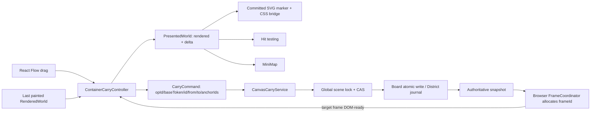

# 绘图融合根治计划 v2（架构重置版）

> 状态：方案已定，尚未执行
> 决策：RESET，不继续修补 LE-011 候选 `59a725a378650c09fdc99f3cde7f4ca892ea06e6`
> 新起点：从已接受 LE-010 的基线 `20c5ae7004f7af931e77a21ad8bd4159e9d0f46a` 重开 `LE-011R`
> 当前边界：只写方案；不操作 4517、真实数据、launchd、远端

## 天启决策

**Computer Use 是观察产品的摄像机，不是决定产品架构的刹车系统。**

LE-011 的产品本质只有四件事：

1. 一次用户手势；
2. 一个拖动期临时位移；
3. 一次带 CAS 的语义提交；
4. 一个目标静态帧已进 DOM 的回执。

此前长期卡住，是因为每次出现新反例，都继续在同一候选中加入迁移、布局、服务端推演、证据协议和验收工具适配。结果“证明系统”变成了第二个产品，且反过来改变正式产品。

本轮停止这种非单调循环。候选 `59a725a…` 只作为失败实验和反例库保留，不 merge、不继续验收、不在其上追加白屏修复。

## 为什么必须重开

相对基线，当前候选：

- 触及 28 个文件；
- 新增 7206 行、删除 509 行；
- 把 `FlowCanvas.jsx` 扩到约 2904 行；
- 把 4518 interaction fixture 扩到约 1620 行；
- 把 `drawing.test.mjs` 扩到约 3893 行，并加入大量源码正则与自定义 evidence validator。

它同时引入了：

- `geometryFrameVersion=1`；
- 固定几何、overflow tray、全局布局行为变化；
- 前端计算并上传完整 authority / drawing 快照；
- 服务端反向导入 `web/` 的布局与绘图算法；
- 双文件 journal、CAS、故障恢复；
- 四场景、十二图、PNG/SHA/IHDR、boot/run/pointer 证据协议；
- 为 Computer Use held-pointer 缺陷新增的正式交互语义。

更严重的是，真实旧数据没有 `geometryFrameVersion=1`，候选也没有迁移入口，因此真实用户首先得到的是“容器搬家被锁”，而不是 LE-011 能力。4518 fixture 手工携带 marker，形成了“验收页可达、真实产品不可达”的断路。

当前 4518 白屏也不是 carry 产品故障，而是验收运行器故障：Vite dev 的 React-refresh inline preamble 和 fixture inline script 被 CSP 拒绝。源码字符串测试与内存 build 没有真正打开页面，所以全绿也发现不了白屏。

## 保留、重写与废弃

### 保留的正确原语

- 锚定归属只从最后已 paint 的 `renderedWorld` 冻结。
- 小容器优先认领；绑定文字继承宿主。
- 已提交 SVG 导出时给元素建立稳定、无点击能力的 DOM marker。
- 拖动热路径只改两个 CSS 变量，不重导 SVG。
- 主画面、命中和 MiniMap 共用同一份 `presentedWorld = renderedWorld + transientDelta`。
- drawing queue 空闲且 `renderedRevision === requestedRevision` 后才允许开始。
- 松手只发一次语义命令。
- 服务端 CAS 拒绝 stale 客户端，绝不接受客户端全量 drawing 覆盖。
- board 单文件原子写；district 的 canvas/layout 双文件变更用小型 durable journal。
- 目标 `frameId` 的 SVG 已进 DOM 后才撤位移桥。
- 最终导出失败时保留可见 stale 帧和桥，提供显式重试。

### 只移植思想、必须重写

- carry reducer 与 effect runner；
- marker 的 Excalidraw 适配层；
- scene lock、严格读取、prepared/committed 恢复；
- CAS、双客户端 lost-update、旧 frame/旧 token 反例测试；
- 4518 的四个业务场景。

不得整体 cherry-pick `59a725a…` 的任何大文件。

### 从 LE-011R 删除或移出

- `geometryFrameVersion` 与任何隐式/显式真实数据迁移；
- fixed geometry、overflow tray、z-band、筛选/展开/缩放/resize/自动整理政策重写；
- 单一 SceneStore 迁移；
- 服务端复跑前端布局算法；
- 客户端上传 `elements`、`beforeElements`、完整 container universe；
- `drawing-files.json` 参与 carry 事务；
- 为验收工具缺陷新增正式产品能力；
- Vite dev/HMR、`/@fs`、React-refresh 组成的 4518 运行器；
- 四轮 Computer Use 作为逐帧正确性主证明；
- 十二图 + PNG 解析 + 自报 `isTrusted` 的自定义证明框架；
- candidate 自己生成、验证并裁决自己的证据；
- 以源码变量名、正则字符串证明运行时行为的测试。

单一 SceneStore 只能在 LE-014 之后另立 RFC。它会把 canvas/layout/drawing-files、全部旧路由和珍贵数据迁移拉进本轮，却仍不能消除 LE-012 的 BinaryFiles 外部事务，当前收益不抵风险。

## 目标不变量

1. **单手势主权**：同一时刻最多一笔 container carry，唯一 `txId` 持有 start/move/drop/cancel。
2. **单帧主权**：归属、像素、命中、MiniMap 只读取最后已进 DOM 的 `renderedWorld`。
3. **单热路径**：pointermove 只更新 `dx/dy` 与 CSS 变量；不得导出 SVG、写盘、重算字体或生成 overlay。
4. **同相位**：任一浏览器采样帧中，容器与本轮锚定墨迹的相对误差不超过 0.5 flow px。
5. **单提交**：非零 drop 恰好产生一个 `opId` 和一次语义命令；zero move / cancel 零写入。
6. **无旧快照覆盖**：服务端在同一 scene lock 内复算 `baseToken`；不匹配则 409、字节零变化。
7. **持久化原子**：board + drawing 单文件同成同败；district + drawing 崩溃后只能回到 before 或到达 after。
8. **交接后撤桥**：只有同一 `txId` 的目标 `frameId` 已进 DOM，才能清 marker class 与 CSS 位移。
9. **失败仍可见**：提交成功但导出最终失败时，桥保持权威位置，其他普通交互不被全局永久锁死。
10. **证据不反向控制产品**：浏览器 runner、Computer Use、截图和 manifest 都是只读 observer。

## 目标架构



### 三个身份

- `txId`：浏览器内本次手势身份；旧手势事件不能触碰新手势。
- `opId`：服务端幂等提交身份；响应丢失后可查询，不靠 UI 猜测是否提交。
- `frameId`：浏览器 FrameCoordinator 为一次 requested world 分配的本地单调身份；服务端不生成。安装成功回执的完整 drawing 时，controller 取得 `targetFrameId`；InkWorldLayer 只在该帧 SVG 已进 DOM 后回报同一 ID。

`txId`、`opId`、`frameId` 不得互相替代。

### 状态机

```text
IDLE
  └─ BEGIN ───────────────> DRAGGING

DRAGGING
  ├─ MOVE ────────────────> DRAGGING
  ├─ CANCEL / ZERO_DROP ──> IDLE
  └─ DROP ────────────────> COMMITTING

COMMITTING
  ├─ COMMIT_OK(hasInk) ───> AWAITING_FRAME
  ├─ COMMIT_OK(noAnchor) ─> IDLE
  ├─ RESPONSE_UNKNOWN ────> QUERYING_OPERATION
  ├─ CONFLICT ────────────> CONFLICT_STALE
  └─ ABORTED ─────────────> IDLE

QUERYING_OPERATION
  ├─ COMMITTED ───────────> AWAITING_FRAME
  └─ NOT_COMMITTED ───────> IDLE

AWAITING_FRAME
  ├─ TARGET_FRAME_READY ──> IDLE
  └─ FINAL_FRAME_ERROR ───> RETRYABLE_PAINT

RETRYABLE_PAINT
  └─ RETRY ───────────────> AWAITING_FRAME
```

`CONFLICT_STALE` 不自动用全图回读猜第三态。服务端保证零写入；当前标签页回到本轮 start 视觉并显示“画布已有新修改，请刷新”。刷新前禁止所有 canvas/layout 写动作；搜索、筛选、平移、缩放、打开会话和查看上下文等只读功能继续可用。

### 浏览器侧唯一真相

纯 reducer：

```js
reduceCarry(state, event) -> { state, commands }
```

正式状态只存在于 controller。React state/ref/DOM CSS 不是三份平级真相：

- controller state 是领域真相；
- React 只订阅派生展示；
- DOM CSS 只是 controller 命令的渲染副作用。

状态转换写入一个只读环形事件账本，记录：

```js
{ seq, txId, event, from, to, opId, baseToken, frameId }
```

高频 MOVE 只保留有限采样；状态转换、提交、冲突、重试和帧交接必须完整保留。4518 和测试只读这本生产账，不再复制一套状态机。

### Marker 与 CSS bridge

不使用异步 overlay/hole acquisition。该方案会新增 overlay-ready 竞态、SVG defs/font 复制、z-order 分叉和额外导出失败面。

采用已验证过的更小机制：

1. 对 Excalidraw 导出副本临时注入 marker link；
2. 导出完成后移除 `href/xlink:href`，只保留 `data-ink-element-id`；
3. marker 适配细节封在 `InkDomAdapter`，领域层不知道 SVG selector；
4. BEGIN 同步给本轮 `anchorIds` 对应的 committed DOM 与 MiniMap 元素加 class；
5. MOVE 只在共同根上写 `--carry-x`、`--carry-y`；
6. hit test 从同一 `presentedWorld` 读取反向平移后的坐标；
7. 目标 frame DOM-ready 后一次清 class 与变量。

marker 不改变真实 Excalidraw elements，不产生可点击链接，不改变每 48 元素固定分组，也不得增加 export 次数。

### Start gate

有绘图时，BEGIN 必须同时满足：

- drawing commit queue pending = 0；
- 没有 opening/closing drawing transaction；
- 没有其他 carry；
- 存在 `renderedWorld`；
- `renderedRevision === requestedRevision`；
- scene `baseToken` 与当前 UI snapshot 同源。

真空绘图可以进行纯几何 carry。任一 gate 不满足时不开始、不移动节点，提示“正在保存上一笔画布操作”。

### 归属计算

归属是最后已 paint 画面的事实，由客户端从：

- `renderedWorld.elements`；
- 本帧已显示的 district/board rect；
- 小容器优先规则；
- 绑定文字继承宿主规则；

冻结出 `anchorIds`。

服务端不重新计算 filter/search/expand 相关的视觉几何，也不导入前端 layout。它只在 CAS 成功后验证：

- target 存在；
- `from/to` 是有限数；
- `anchorIds` 去重、均存在于当前 drawing；
- delta 与目标位置一致；

然后只平移这些 ID。这里客户端发送的是“小型用户意图”，不是全量 drawing 权威快照。

### 服务端协议

`GET /api/graph` 新增只读 `sceneToken`。它是规范化 `canvas + layout` 的 SHA-256，不写入用户 schema。

提交：

```json
{
  "opId": "uuid",
  "baseToken": "sha256",
  "containerId": "board:123",
  "from": { "x": 100.25, "y": 80.5 },
  "to": { "x": 132.25, "y": 98.5 },
  "anchorIds": ["shape-a", "label-a"]
}
```

成功回执：

```json
{
  "status": "committed",
  "opId": "uuid",
  "sceneToken": "new-sha256",
  "container": { "kind": "board", "id": "board:123", "x": 132.25, "y": 98.5 },
  "drawing": [{ "id": "完整 committed element 数组，示例省略其余字段" }],
  "movedIds": ["shape-a", "label-a"]
}
```

`drawing` 是完整权威 committed element 数组，不是增量、占位或客户端回显；图片 files 不变，继续复用当前已加载 files。`container` 是本次目标的规范化持久位置。客户端以二者更新当前 graph，并把完整 drawing 请求交给 FrameCoordinator；FrameCoordinator 返回本地 `targetFrameId`，随后 reducer 才进入 `AWAITING_FRAME`。HTTP 响应本身不含 `frameId`。

冲突使用 HTTP 409，只返回类型化原因和当前 token，不写任何文件，不在 UI 自动做全图“第三态”猜测。

响应未知时使用：

```text
GET /api/container-carry-status?opId=...
```

服务端保留有界、持久的操作 receipt；重试同一 `opId` 必须返回同一结果，不重复位移。保留所有 7 天内 receipt，并额外保留最近 128 条；清理只能发生在 journal 恢复完成后，不能删除 active op。客户端在 `RESPONSE_UNKNOWN` 后立即查询；`OP_UNKNOWN` 只允许进入 stale/人工刷新，绝不能自动重放位移。

### Scene token 规范

scene token 只由服务端计算，客户端把它当作 opaque string，不自行复算。

服务端输入固定为：

```text
{
  canvas: { edges: [], notes: [], boards: [], drawing: [], ...strictPersistedCanvas },
  layout: strictPersistedLayout
}
```

规范化规则：

- 对象键递归按 Unicode code point 排序；
- 数组保持原顺序；
- 只允许 JSON 值；
- 非有限数直接判数据损坏；
- `-0` 规范为 `0`；
- 缺失的四个 canvas 顶层数组使用上述空数组默认值；
- 不包含 `drawingFiles`、scan graph、时间戳、receipt 或 journal；
- 对规范 JSON 的 UTF-8 字节做 SHA-256。

token 的唯一用途是并发版本比较；它不写入 canvas/layout，不要求真实数据迁移。

### Repository 与 journal

CAS 有效的前提是所有 canvas/layout 写入共用一个 scene lock。先把现有 edge/note/board/drawing/layout 写入口机械收口到 repository，但不改变其外部行为。

固定运行时路径：

```text
data/.canvas-scene.lock/
data/canvas-carry-journal.json
data/canvas-carry-receipts/<opId>.json
```

这三者是可恢复的事务元数据，不属于用户内容 schema。所有 durable JSON 写都必须走：同目录 temp 写入 → file `fsync` → atomic rename → parent directory `fsync`。

journal 固定 schema：

```json
{
  "schemaVersion": 1,
  "phase": "prepared | committed",
  "opId": "uuid",
  "baseToken": "sha256",
  "afterToken": "sha256",
  "createdAt": "ISO-8601",
  "before": { "canvas": {}, "layout": {} },
  "after": { "canvas": {}, "layout": {} },
  "result": {
    "status": "committed",
    "opId": "uuid",
    "sceneToken": "sha256",
    "container": {},
    "drawing": [],
    "movedIds": []
  }
}
```

`before/after` 是不含 drawing files 的完整逻辑文档。receipt 只保留幂等查询所需的最小字段：

```json
{
  "schemaVersion": 1,
  "opId": "uuid",
  "committedAt": "ISO-8601",
  "result": {
    "status": "committed",
    "opId": "uuid",
    "sceneToken": "sha256",
    "container": {},
    "drawing": [],
    "movedIds": []
  }
}
```

carry 服务在锁内：

1. 恢复遗留 journal；
2. 严格读取 canvas/layout，损坏即阻断；
3. 复算 scene token；
4. CAS；
5. 纯函数生成 after；
6. durable 写 `prepared` journal，内容固定含 schemaVersion、opId、baseToken、before、after 与完整成功回执；
7. board：一次 canvas durable rename；district：依次 durable 写 canvas 与 layout；
8. durable 把同一 journal 标为 `committed`；
9. durable 写最小 receipt；确认 receipt 与目录均 fsync 后，再删除 committed journal 并 fsync data 目录；
10. 返回 journal / receipt 共有的权威回执。

恢复规则：

- `prepared`：幂等回到 before；
- `committed`：幂等前滚到 after，durable 补齐最小 receipt 后再删除 journal；
- committed journal 与 receipt 同时存在时，先校验 opId/result 一致，再前滚并只删除 journal；
- 新 carry 在 token CAS 前先查同 opId receipt；已存在则原样返回，绝不再次应用 delta；
- journal JSON 或 schema 损坏：阻断写入，绝不当作不存在；
- daemon 启动、`GET /api/graph`、任一 scene mutation、carry status query 四个入口都先触发恢复；
- 查询 status 前也必须先在同一 lock 内恢复 journal；
- 只要 scene 已被承认为 committed，就必然仍有 committed journal 或 receipt，禁止出现“数据已提交、status 却说未提交”的空窗；
- receipt 清理失败不把已 durable committed 误报成失败。

`drawing-files.json` 不读、不写、不进 carry journal。LE-012 可复用 scene lock、strict read 与 journal 原语，但另行设计资产先写、引用后写。

## 模块边界与代码预算

建议模块：

```text
shared/canvas-carry.mjs
  ownership、applyCarry、reducer、协议校验；无 React/DOM/fs

web/src/canvas/container-carry.js
  controller、effect runner、环形事件账本、DOM marker class 安装/清理

web/src/canvas/FlowCanvas.jsx
  仅接 React Flow start/move/stop，carry-specific 接线不超过约 100 行

web/src/canvas/InkWorldLayer.jsx
  marker 导出适配与 FRAME_READY/FRAME_FAILED

web/src/canvas/MiniMapInk.jsx
  只消费 presented delta

web/src/App.jsx
  分发语义 carry、安装完整权威 drawing/container

web/src/api.js
  carry commit/status API

web/src/theme.css
  marker 与 MiniMap 共用 CSS variables

server/canvas-repository.mjs
  scene lock、strict read、token、carry command、atomic write、journal、receipt

server/index.mjs
  graph token 与 carry commit/status 路由

tests/carry/*.test.mjs
tests/browser/carry-acceptance.spec.mjs
tests/fixtures/carry-acceptance/
```

硬预算：

- runtime 文件固定为上述 10 个；若必须增加第 11 个，立即 HOLD 并重新 review。docs、tests、fixtures、evidence、package 与独立 harness 配置不计入，但不得借此放入产品逻辑；
- runtime 净新增超过 1200 行即 HOLD；
- carry reducer/controller 合计不超过约 300 行；
- carry fixture 主体不超过约 300 行；
- `FlowCanvas` 不得继续拥有 carry phase/recovery 细节；
- server 不得 import `web/`；
- 超预算立即停止实现，先重新做架构 review。

## 失败模型

| 故障 | 规定结果 |
|---|---|
| queue 忙 / rendered 落后 | 不开始、不移动、零写入 |
| zero move / Esc / pointer cancel | 节点复位、桥清零、零写入 |
| 双客户端 stale | 409、字节零变化、当前页回到 start 并要求刷新 |
| board 写失败 | canvas 保持 before，UI 回到 start |
| district 第一文件后崩溃 | 下次进入 repository 时由 prepared 回滚 |
| district durable 后清 journal 失败 | 返回 committed；下次由 committed 前滚并清理 |
| HTTP 回执丢失 | 用 opId 查询 receipt，不读全图猜状态 |
| 旧 tx / 旧 frame 迟到 | reducer 忽略 |
| 目标 SVG 三次导出失败 | 保留权威 bridge，进入 retryable paint；不全局锁死 |
| 无 anchor | 同一命令，`anchorIds=[]`；安装权威 container 后直接结束，无 bridge、无新 drawing frame |
| container 被并发删除 | CAS 冲突，零写入 |
| journal 损坏 | 阻断写入并明确报错 |

## 验收体系重建

测试只证明自己所在的层，不混门。

### G0 环境门

- Node 版本、字体与依赖存在；
- 4518 端口可用；
- 先实际调用 `node_repl` 验证 Computer Use；
- 记录 Computer Use 是否能产生真实 held pointermove。

Computer Use 能力不足只能得到 `UX_SMOKE_UNAVAILABLE`，不得改产品来迎合工具，也不得把环境失败写成产品失败。

### G1 纯领域与 repository

- reducer 全部合法/非法状态转换；
- 旧 `txId/opId/frameId`、重复事件、unmount；
- ownership 重叠、小容器优先、绑定文字；
- MOVE 合并与绝对 delta；
- 双客户端 CAS；
- opId 幂等与响应丢失；
- scene 已写 / journal committed / receipt durable 三个崩溃窗；
- receipt 保留与 `OP_UNKNOWN` 不自动重放；
- board 原子写；
- district prepared/committed crash recovery；
- journal 损坏；
- 任一文件首写失败；
- 小数坐标；
- 800 元素性能预算。

禁止用 source-string 代替行为测试。

### G2 build 与静态 4518 harness

4518 不再运行 Vite dev server：

1. 单独生产 build 到临时 dist；
2. index 不含 inline script/style；
3. 只读静态 server 只暴露 index/assets；
4. `/api/*` 一律 403；
5. 不存在 HMR、React refresh、`/@fs`；
6. CSP 保持 `script-src 'self'`；
7. 自动真实打开 `/`，等待 app-ready，并捕获 console/page/resource error。

页面启动本身是第一条测试，白屏不得再躲过 build。

### G3 Playwright 确定性浏览器行为

四个 fresh 场景的动作与终态固定如下：

| 场景 | 动作 / 注入 | 必须终态 |
|---|---|---|
| normal | 有 anchor 容器 held drag 后正常提交 | 一个 opId；target frame ready 前桥保持，ready 后清一次；位置持久化 |
| export-retry | 有 anchor 正常提交；目标 frame exporter 连续失败三次 | 进入 retryable paint 且桥仍在；显式 retry 成功后 target frame ready 并清一次 |
| no-anchor | `anchorIds=[]` 的容器 held drag | 同一 carry API 恰好一次；container 权威位置安装后直接 IDLE；无 marker、无 drawing export |
| authority-conflict-800 | 800 元素完成 BEGIN 后，由第二客户端先改变 scene token，再 DROP | 当前请求 409、字节零变化、节点/桥回到 start、进入 CONFLICT_STALE；无 target frame |

使用 locator 实时读取 grip bounding box，再由 Chromium `mouse.down → mouse.move(steps) → mouse.up` 产生真实 held pointer，不写死屏幕坐标。Playwright 的 Mouse API明确支持 down/move/up 与分步 move；断言使用自动重试或 `expect.poll`，失败保留 trace。

所有包含 live MOVE 的场景硬验：

- 至少 60 个 rAF 样本；
- 主画布以 `getBoundingClientRect()` 测得的容器/锚定墨迹相对误差 ≤ 0.5 CSS px；
- 无关墨迹位移 ≤ 0.1 CSS px；
- MiniMap 按当前 viewBox 比例换算后的相对误差 ≤ 0.5 CSS px；
- drag 期间 export count = 0；
- drop 恰好一个 opId；
- console/page error/API access 均为 0。

800 元素预算：

- BEGIN 的 ownership + marker 安装总耗时 < 50ms；
- MOVE handler 耗时 p95 < 4ms；
- drag 窗口内不得出现 ≥50ms Long Task；
- export count 仍为 0。

逐帧事实来自生产事件账本和页面测量，不来自截图。

### G4 Computer Use 视觉烟测

架构重置后不再以四轮人工 Computer Use 证明逐帧正确性。G3 的四场景是唯一可重复行为 gate。

LE-011R 的最终要求固定为 **恰好一次** fresh 4518 Computer Use 可用性复核：

- 地址为固定 4518；
- 页面非白屏；
- 可见真实容器、墨迹和 PASS 结果；
- 若工具支持 held pointer，可做一次拖动观感复核；
- 若不支持，记录 `UX_SMOKE_UNAVAILABLE`，不阻塞 G3 的代码正确性 verdict。

旧计划的四轮 Computer Use 要求被本重置方案明确 supersede。若外部治理另行索取更多截图，它们属于 LE-011R verdict 之外的非阻塞视觉附件，不能成为状态机或事务真相。

### G5 独立 Judge

Judge 只接受分层结果：

```text
G0 ENV
G1 DOMAIN_REPOSITORY
G2 BUILD_HARNESS
G3 BROWSER_BEHAVIOR
G4 UX_SMOKE
```

manifest 由候选外的 loop driver 绑定 candidate SHA、harness SHA、browser version、trace 和日志。候选不能定义自己的最终 verifier。

## 执行阶段

### R0 止损与新分支

- 冻结 `59a725a…`，保留 evidence；
- 从 `20c5ae7…` 新开 `LE-011R`；
- 不整体 cherry-pick；
- 先加 regression inventory，标明哪些来自 attempt 2/3 Judge。

Gate：diff 中无 `geometryFrameVersion`、fixed geometry、overflow tray、全局布局政策和自定义 PNG evidence framework。

### R1 共享纯内核

- 实现 reducer、ownership、applyCarry、协议校验；
- 建立 tx/op/frame 三身份；
- 建立只读事件账本。

Gate：模型测试全绿；随机事件序列不破坏十条不变量。

### R2 Repository 与服务端命令

- 所有 canvas/layout mutation 共用 scene lock；
- graph 返回 sceneToken；
- carry API 只接语义命令；
- board atomic；
- district journal；
- op receipt/status。

Gate：双客户端、响应丢失、崩溃点、损坏 journal、字节零变化反例全绿；server 无 `web/` import。

### R3 DOM bridge 与 UI 接线

- marker 适配；
- controller；
- FlowCanvas start/move/stop；
- hit/MiniMap presented world；
- frame ack 与 retry。

Gate：pointermove O(1)、drag export 0、旧 frame 不清新桥、失败不永久锁全画布。

### R4 静态 4518 与 Playwright

- 拆出 carry-only fixture；
- build 到临时 dist；
- 只读 4518；
- 四场景真实 Chromium。

Gate：G2、G3 全绿；失败 trace 可重放；fixture 不复制 reducer/service。

### R5 Computer Use 与独立 Judge

- 先用 `node_repl` 做能力预检；
- 一次 4518 视觉烟测；
- 生成候选外 manifest；
- 独立 Judge。

Gate：G1/G2/G3 必须 PASS；G4 为 `UX_SMOKE_PASS` 或如实记录工具能力不足；禁止操作 4517、真实数据、launchd、远端。

## 后续 backlog 重新切分

| ID | 新职责 |
|---|---|
| LE-011R | direct container carry：手势、CSS bridge、CAS/journal、paint ack |
| LE-011B | 自动整理/撤销复用 batch carry command，不再 `reload + 120ms` 追赶 |
| LE-012 | draft journal 与 BinaryFiles 安全写；只复用 repository 原语 |
| LE-013 | 自动沉底/撤销与可达性；不夹带 carry |
| LE-014 | 全局收敛与真实页只读 console；SceneStore 另立 RFC 后再决定 |

LE-011R 未独立通过前，不开始 LE-011B。自动整理不是 direct drag 的隐藏前置条件。

## 停止条件

出现任一项立即 HOLD，不继续加补丁：

- runtime 改到第 11 个文件或净新增超过 1200 行；
- 新增持久 schema 或真实数据迁移；
- server import `web/`；
- pointermove 触发 export、持久化、字体或 ownership 重算；
- fixture 开始复制 reducer/service；
- 为 Computer Use 能力不足改正式交互；
- 候选自己生成并验证最终证据；
- 需要修改 4517、真实数据、launchd 或远端才能证明 4518；
- 任一失败只能靠“再多截几张图”解释。

## 技术依据

- Playwright Mouse 提供 `down`、分步 `move`、`up`，适合确定性验证真实 held pointer。
- Playwright assertions 支持自动重试与 `expect.poll`，适合等待 rAF/帧交接事实。
- BrowserContext 可监听 console、page error 与失败请求；trace 可在失败时保留调试证据。
- 4518 使用生产静态 build，避免 Vite dev React-refresh inline preamble 与严格 CSP 的结构性冲突。

参考：

- <https://playwright.dev/docs/api/class-mouse>
- <https://playwright.dev/docs/test-assertions>
- <https://playwright.dev/docs/api/class-browsercontext>
- <https://playwright.dev/docs/api/class-tracing>
- <https://vite.dev/config/shared-options#html-cspnonce>

## GSTACK REVIEW REPORT

### Runs

| Review | 轮次 | 结果 |
|---|---:|---|
| Oracle Architecture | 1 | CLEAR：放弃整包候选，保留 marker/CSS、CAS/journal、paint ack |
| Oracle Code | 1 | CLEAR WITH ACTIONS：拆掉生产/fixture/verifier 三套状态机与 server→web 反向依赖 |
| Engineering Challenge | 1 | CLEAR：选择双文件 CAS+journal，拒绝 SceneStore 与 overlay/hole |
| Root Synthesis | 1 | CLEAR：客户端冻结可见 anchorIds；服务端做 token CAS 与小型意图校验 |
| Reader Test | 2 | CLEAR：首轮 receipt/frame 契约退回修改；次轮确认无实现阻塞 |

### Status

- 目标、非目标、数据边界、协议、状态机、失败模型、阶段门和停止条件均已明确。
- `59a725a…` 明确退役为研究候选。
- 原四轮 Computer Use 正确性门被四场景 Playwright 取代；Computer Use 降为一次只读视觉烟测。
- receipt 崩溃空窗、frameId 所有权、权威响应、token 规范和逐场景终态已在 Reader Test 后闭合。
- 本方案不要求操作 4517、真实数据、launchd 或远端。

### Findings

| 严重度 | Finding | Resolution |
|---|---|---|
| P1 | `geometryFrameVersion=1` 令真实旧数据不可达 | 从 LE-011R 完全删除，不做迁移 |
| P1 | 4518 dev/HMR 与 CSP 必然白屏 | 改为生产静态 build，boot 成为自动 gate |
| P1 | 客户端全量 drawing + server 反向导入 web | 改为 anchorIds 语义命令、scene token CAS、共享纯 core |
| P1 | 证据系统复制并裁决产品状态机 | 生产事件账本只读；最终 verifier 候选外持有 |
| P1 | 双文件写与多标签 stale overwrite | 全局 scene lock、CAS、prepared/committed journal、op receipt |
| P1 | 数据已提交但 receipt 未落盘的崩溃空窗 | committed journal 先持有完整回执，receipt durable 后才删 journal |
| P1 | frameId 与权威响应归属不明 | 服务端返回完整 drawing/container；浏览器安装时分配 targetFrameId |
| P2 | Computer Use held pointer 能力不稳定 | 环境预检；Playwright 是可重复正确性 gate |

VERDICT: CLEAR — 可以按 R0→R5 执行，但本轮只交付方案，不开始实现。

NO UNRESOLVED DECISIONS
